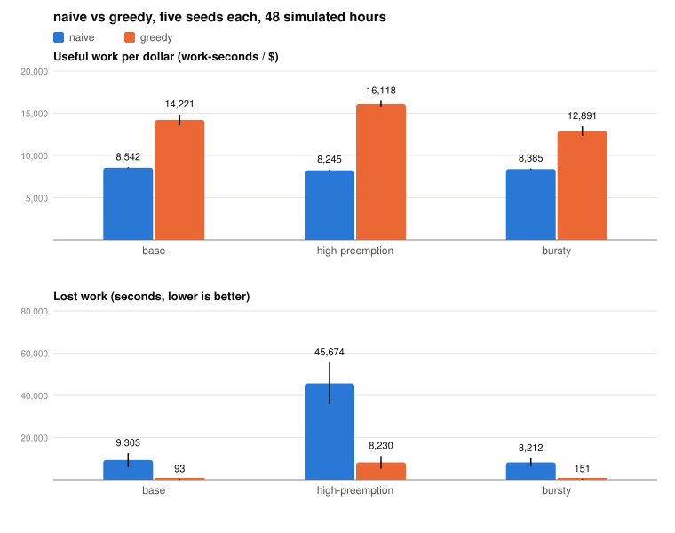
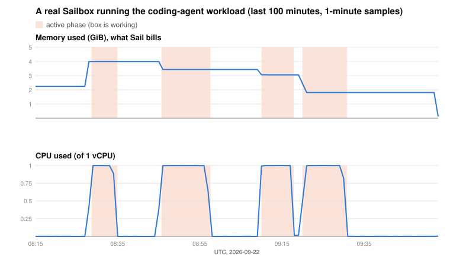

# CTO — Chief Token Officer

A simulator for one question: **how do you run long-lived AI agent sandboxes
on cheap, preemptible cloud hosts without paying for idle capacity or losing
work when a host gets reclaimed?**

Agent sandboxes live for hours, spend most of that time asleep waiting on a
model, and can be live-migrated. Spot hosts cost half as much but vanish with
two minutes' notice. CTO plays out that world as a discrete-event simulation
and compares scheduling policies on a single number: **useful work per
dollar**. Same seed in, byte-identical results out. Go, standard library only.

## Results

<picture>
  <source media="(prefers-color-scheme: dark)" srcset="docs/compare-dark.svg">
  
</picture>

`naive` packs boxes by what they *requested* and never moves anything.
`greedy` packs by what they actually *use*, moves boxes to keep hosts full,
and evacuates a reclaimed host most-valuable-work-first. Greedy does about
three times the work for less than twice the money, and almost never loses
any. The one place it struggled, 60-second reclaim warnings, was fixed by
holding one host's worth of slack: a warning is shorter than a boot, so the
room has to exist before the warning comes.

## Checked against a real platform

The model is shaped after Sail Research's Sailboxes, so I ran three of them
for eight hours ($1.00 total) with agent-shaped workloads and pulled Sail's
own metrics.

<picture>
  <source media="(prefers-color-scheme: dark)" srcset="docs/trace-dark.svg">
  
</picture>

What held up:

- Sail bills observed memory, sampled every 15 seconds. Memory is elastic:
  the guest boots with 1.9 GiB and grows on demand.
- CPU follows the work phases exactly, and idle time is free once a box sleeps.

What didn't:

- The resident floor I assumed (0.25 GB) is twice the real one (0.12 GiB).
- Allocate faster than the guest's memory can grow and the kernel kills your
  process. The model's bounded ramp has no failure mode.
- My waits used `time.sleep()`, which Sail's idle rule counts as *not idle*,
  so the boxes stayed awake through every wait. A real agent blocked on an
  inference call is allowed to sleep. Good to know before you assume.
- Migrations and preemptions are invisible from outside. That half of the
  model is a hypothesis about Sail's internals, not a measurement.

Raw traces, spend, and the scripts are under `scenarios/traces/` and
`scripts/sail/`. Full notes in [DESIGN.md](DESIGN.md).

## Quickstart

```
make            # build
make test
make compare    # naive vs greedy, five seeds, every scenario
go run ./cmd/cto run -scenario scenarios/base.json -controller greedy -seed 42 -out summary.json
```

## How it works

```
 seeded workload ──▶ event queue (At, Seq) ──▶ World: hosts, boxes, migrations
                                                   │  read-only snapshot
                                                   ▼
                                          Controller: Place · Tick · OnReclaim
                                          naive | greedy | lp (stub)
```

- Boxes arrive as a Poisson process and alternate *active* bursts with
  *waiting-on-inference* phases. Memory ramps toward a target; only active
  phases do work or dirty pages.
- A waiting box sleeps after 5 s: CPU 0, memory to a small floor, and paging
  out doubles as a checkpoint. Every 600 s awake boxes checkpoint too.
- Hosts are spot capacity with a preemption hazard. A reclaim gives 120 s
  (60 s in the hard scenario), then the host dies and every box still on it
  loses its work since the last checkpoint.
- Migration cost comes from dirty pages:

      transfer_sec = (dirty_gb + floor) / (min(net_a, net_b) / slots)
      downtime_sec = 2 + 0.2 × transfer_sec

- Billing is per host-second. `work_per_dollar` = useful active seconds /
  dollars. In a real system that's tokens or tasks per dollar.

## What greedy does

1. Places by observed memory plus 20% headroom, best-fit, so hosts fill up
   and empties can be drained.
2. Every minute, moves one box off any host over 90%, picking the box that
   frees the most memory per second of migration.
3. Drains hosts under 25% and shuts them down.
4. Keeps enough free room to re-home its fullest spot host, and launches
   ahead of time when that slack is gone.
5. On a reclaim warning, orders boxes by uncheckpointed work per migration
   second and skips any that can't finish before the deadline.

`lp` is where an ILP version would go (minimise host cost + λ·migration cost
subject to capacity and one-host-per-box); the formulation is written out in
`internal/controller/lp.go`, no solver.

## Limitations

Single region, no network topology, no disk model, independent preemptions
(real spot reclaims come in waves), slot-based bandwidth, no OOM. The
workloads used for calibration are synthetic; real agent traces would be the
next thing to ask for.
