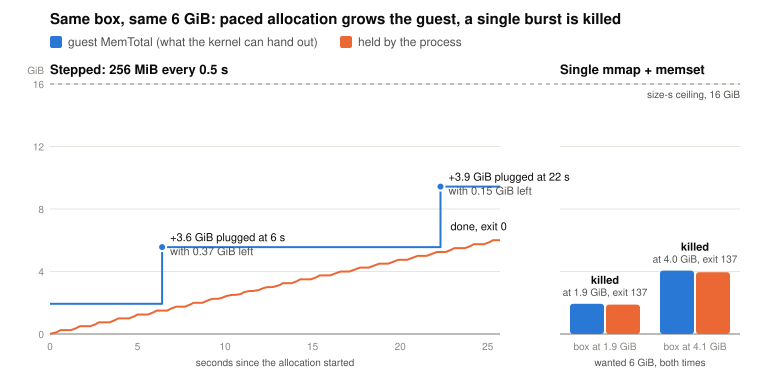

# Sailboxes can OOM under a 16 GiB ceiling

*Investigation, 2026-09-23, reproduced 2026-09-26. Follows the calibration run in [DESIGN.md](../DESIGN.md) §10.*

## Summary

The Sailboxes overview states that agents "will never OOM" because guest
memory grows on demand. That is not true when a process allocates faster than
the guest's memory can be hot-plugged. On fresh size-**s** boxes with a 16 GiB
ceiling I OOM-killed a process at 1.9, 4, 4.3, and 7.4 GiB resident across two
sessions, all well under the limit, and captured the guest kernel's own log of
every kill.

The mechanism is that guest memory is grown reactively by `virtio_mem`, and the
plug **lags** the allocation. Allocate in small steps with a pause and the plug
keeps up; allocate a large region and fault it as fast as `memset` runs and the
kernel runs out before the plug arrives.

This corrects an earlier claim (DESIGN.md §10 and the `workload.py` header) that
the first deep-research box was OOM-killed "62 s in" at 1.93 GiB. The box did
die on its first allocation, but no kernel log was captured at the time, and
the 1.93 GiB figure was situational: it OOMs only when the allocation outruns
the plug, which depends on how much memory is already resident. The finding
below is what the evidence actually supports.

## Method

Fresh size-s box (`sb_f060d7ff-3cc8-40fe-9470-1764aef903e2`, app `cto`,
16 GiB ceiling), self-terminating after one hour, terminated by hand once done.
Two allocators, each logging guest `MemTotal` and `MemAvailable` from
`/proc/meminfo` as it ran:

1. **Stepped** — 64 MiB chunks, four at a time, `time.sleep(0.5)` between
   steps, every page faulted. This is what the fixed `workload.py` does.
2. **Single-shot** — one `create_string_buffer(N)` then `memset` over the whole
   region as fast as libc runs, no pauses.

Guest `dmesg` was read immediately after each run. Total spend was a few cents;
the box ran under two minutes before termination.

## Results

**Stepped, 1.93 GiB — survived.** The box booted with 1.934 GiB `MemTotal`.
The resident set climbed while available memory fell to a razor-thin
**0.371 GiB**, at which point `virtio_mem` plugged more and `MemTotal` jumped to
4.934 GiB. The allocation finished at 5.559 GiB total, exit 0. The plug kept up,
but only just, and only because the pauses gave it time.

| held (GiB) | t (s) | MemTotal (GiB) | MemAvailable (GiB) |
|-----------:|------:|---------------:|-------------------:|
| 0.31 | 0.7 | 1.934 | 1.560 |
| 1.50 | 3.3 | 1.934 | **0.371** |
| 1.56 | 3.5 | **4.934** | 3.233 |
| 1.88 | 4.1 | 5.559 | 3.531 |

**Single-shot — killed above the plug's rate.** By this point the box had
grown to 4.18 GiB `MemTotal`.

| target (GiB) | result | exit |
|-------------:|--------|-----:|
| 1.93 | completed | 0 |
| 6 | **OOM-killed** | 137 |
| 12 | **OOM-killed** | 137 |

Guest kernel log at the 6 GiB kill:

```
python3 invoked oom-killer: gfp_mask=0x140cca(GFP_HIGHUSER_MOVABLE|__GFP_COMP), order=0
Out of memory: Killed process 197 (python3) total-vm:6306076kB, anon-rss:4275016kB, ...
oom-kill:constraint=CONSTRAINT_NONE, ..., global_oom, task=python3, pid=197
```

`virtio_mem` was still catching up at the moment of the kill:

```
virtio_mem virtio3: plugged size: 0xe8000000   requested size: 0x90000000
Out of memory: Killed process 197 (python3)     [t = 70.9s]
virtio_mem virtio3: plugged size: 0x90000000   requested size: 0x150000000
```

Resident at the kill was ~4.3 GiB (6 GiB run) and ~7.4 GiB (12 GiB run), both
far under the 16 GiB ceiling.

## Interpretation

- **OOM is real under the ceiling.** Exit 137 with `oom-killer` in `dmesg` is
  a hard SIGKILL from the guest kernel, not the platform. The "will never OOM"
  wording needs a caveat about allocation rate versus hot-plug rate.
- **The plug is reactive and lags.** In the stepped run, available memory fell
  to 0.371 GiB before more was plugged. A burst faster than the plug loses the
  race even though the ceiling is nowhere near.
- **The mitigation works.** Growing in 256 MiB steps with a short pause let the
  plug keep pace at every point. `workload.py` already does this; the report
  confirms it is load-bearing, not a nicety.
- **Whether a given size OOMs is not fixed.** 1.93 GiB survived here because the
  box had already grown to 4.18 GiB. The original deep-research box booted at
  1.934 GiB and asked for 1.93 GiB at once, which is exactly the losing race.

## Reproduced on a fresh box, 2026-09-26

Rerun three days later on a new size-s box
(`sb_d20536f4-b0a7-4812-a77c-6c1ad3661e00`, app `cto`, 16 GiB ceiling,
auto-sleep off, terminated after four minutes). Same two allocators, now in one
script, `scripts/sail/alloc.py`. Raw logs, the kernel log after each run, and a
manifest are under `scenarios/traces/oom-2026-09-26/`.

<picture>
  <source media="(prefers-color-scheme: dark)" srcset="oom-dark.svg">
  
</picture>

| order | allocator | guest MemTotal at start | asked | resident at kill | result |
|------:|-----------|------------------------:|------:|-----------------:|--------|
| 1 | single-shot | 1.93 GiB (fresh boot) | 6 GiB | 1.88 GiB | **killed**, exit 137 |
| 2 | stepped | 1.93 GiB | 6 GiB | — | completed, exit 0, guest grew to 9.43 GiB |
| 3 | single-shot | 4.06 GiB | 6 GiB | 3.95 GiB | **killed**, exit 137 |

Runs 1 and 2 started from the same memory state, because run 1 died before
anything was plugged. Pacing was the only variable.

This run is cleaner than the first. On the 23rd the plug was mid-flight at the
kill. Here there is **no plug activity anywhere near either kill**. The
complete `virtio_mem` history for the box's life:

```
[   0.34] plugged 0x0          requested 0x0            boot
[  37.96] Out of memory: Killed process 197 (python3) anon-rss:1973624kB     <- run 1
[  82.85] plugged 0x0          requested 0xe8000000     run 2, first plug (+3.6 GiB)
[  98.83] plugged 0xe8000000   requested 0x1e0000000    run 2, second plug (+3.9 GiB)
[ 102.83] plugged 0x1e0000000  requested 0x160000000    shrinking after exit
[ 122.83] plugged 0x160000000  requested 0xe0000000
[ 138.83] plugged 0xe0000000   requested 0x88000000
[ 182.00] Out of memory: Killed process 219 (python3) anon-rss:4146664kB     <- run 3
```

Run 1 was killed 38 s after boot with zero bytes ever plugged. Run 3 was killed
43 s after the last plug event. Both are `global_oom`, `CONSTRAINT_NONE`: the
guest kernel believes the whole machine is out of memory.

The stepped run shows what the growth path looks like when it does fire. Free
memory fell to **0.371 GiB** at 6.1 s and MemTotal jumped 3.6 GiB by 6.4 s;
it fell to 0.149 GiB at 22.1 s and MemTotal jumped again by 22.3 s. The 0.371
figure is the same one recorded on the 23rd, which points at a fixed low-memory
trigger. Once triggered, the plug lands within about a second. So growth is
fast, but it only fires on observed pressure, and a `memset` fills 1.9 GiB in
well under a second. The allocation is over before the trigger can see it.

## For the simulator

The model's bounded ramp (`mem_ramp_gb_per_sec`) is the right shape but has no
failure mode: a box that outruns the ramp keeps ramping instead of dying. A
faithful version would kill (or stall) a box whose demanded growth exceeds the
plug rate for long enough that `MemAvailable` hits zero. This is unmodelled and
noted as a limitation.

## Open questions for Sail

1. A supported way to pre-warm or reserve guest memory to a floor before a
   burst, so a legitimate large allocation does not lose the race.
2. The allocation rate `virtio_mem` can actually sustain; the 15-second metrics
   cannot pin it.
3. Whether the "never OOM" wording should be qualified.

## Reproduction

Scripts are under `scripts/sail/`. `alloc.py single 6` and `alloc.py stepped 6`
are the two allocators from the 26th, logging `/proc/meminfo` as they run. The
stepped allocator is also what `workload.py` does; the original single-shot
allocator is inlined below.

```python
import ctypes, sys
GIB = float(sys.argv[1]); N = int(GIB * (1 << 30))
buf = ctypes.create_string_buffer(N)   # one mmap of the whole size
ctypes.memset(buf, 0x41, N)            # fault every page as fast as libc runs
```

Run it on a fresh size-s box, escalating the target past the boot-time
`MemTotal`, and read `dmesg | grep -i oom` after each kill.
